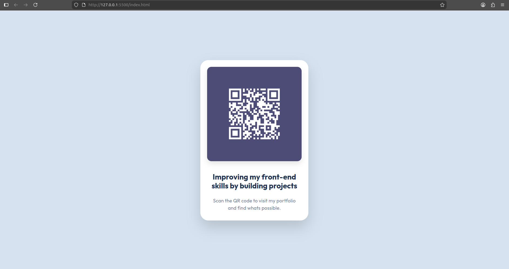

# QR Code Component

A responsive and accessible QR code component built with HTML5 and CSS3, showcasing modern frontend development best practices.



## 📋 Table of Contents

- [Overview](#overview)
- [Features](#features)
- [Technologies Used](#technologies-used)
- [Getting Started](#getting-started)
- [Responsive Design](#responsive-design)
- [Accessibility](#accessibility)
- [Project Structure](#project-structure)
- [Browser Support](#browser-support)
- [Contributing](#contributing)
- [License](#license)
- [Contact](#contact)

## 🎯 Overview

This project demonstrates a clean, modern QR code component card that adapts seamlessly across all device sizes. It features a minimalist design with careful attention to typography, spacing, and user experience.

### Purpose

The component serves as a portfolio piece showcasing frontend development skills, including:
- Semantic HTML5 markup
- Advanced CSS3 styling and layouts
- Responsive design principles
- Web accessibility standards (WCAG 2.1)
- Modern web development best practices

## ✨ Features

- **Fully Responsive**: Optimized for screen sizes from 320px to 1920px+
- **Accessible**: WCAG 2.1 AA compliant with keyboard navigation support
- **Modern Design**: Clean, minimalist interface with subtle shadows and rounded corners
- **Performance Optimized**: Lightweight with minimal dependencies
- **Cross-Browser Compatible**: Works on all modern browsers
- **Reduced Motion Support**: Respects user preferences for animations
- **High Contrast Mode**: Enhanced visibility for users with visual impairments

## 🛠 Technologies Used

- **HTML5**: Semantic markup structure
- **CSS3**: Modern styling with custom properties and flexbox
- **Google Fonts**: Outfit font family for clean typography
- **No JavaScript Required**: Pure CSS solution for better performance

## 🚀 Getting Started

### Prerequisites

- A modern web browser (Chrome, Firefox, Safari, Edge)
- A text editor or IDE (VS Code, Sublime Text, etc.)
- Basic understanding of HTML and CSS

### Installation

1. Clone the repository:
```bash
git clone https://github.com/yourusername/qr-code-component.git
```

2. Navigate to the project directory:
```bash
cd qr-code-component
```

3. Open `index.html` in your browser:
```bash
# On macOS
open index.html

# On Windows
start index.html

# On Linux
xdg-open index.html
```

### Local Development

For a better development experience, use a local server:

**Using Python 3:**
```bash
python -m http.server 8000
```

**Using Node.js (http-server):**
```bash
npx http-server
```

Then open `http://localhost:8000` in your browser.

## 📱 Responsive Design

The component is optimized for the following breakpoints:

| Device Type | Screen Width | Card Max-Width |
|-------------|--------------|----------------|
| Mobile Small | 320px | 280px |
| Mobile | 375px | 320px |
| Tablet | 768px | 360px |
| Desktop Small | 1024px | 380px |
| Desktop | 1440px | 400px |
| Desktop Large | 1920px+ | 420px |

### Testing Responsive Design

To ensure proper rendering across all devices:

1. Use browser DevTools responsive mode
2. Test on physical devices when possible
3. Verify text readability at all breakpoints
4. Check touch target sizes (minimum 44x44px)

## ♿ Accessibility

This project follows WCAG 2.1 Level AA guidelines:

### Features Implemented

- **Semantic HTML**: Proper use of `<main>`, headings, and alt attributes
- **Color Contrast**: All text meets minimum contrast ratios
  - Heading: 11.63:1 (exceeds AAA)
  - Paragraph: 4.88:1 (meets AA)
- **Keyboard Navigation**: Full keyboard accessibility with visible focus indicators
- **Reduced Motion**: Respects `prefers-reduced-motion` media query
- **High Contrast Mode**: Enhanced borders and weights for better visibility
- **Scalable Text**: Uses relative units (rem) for text sizing
- **Responsive Images**: Properly sized and optimized images

### Testing Accessibility

Run these checks to verify accessibility:

1. **Keyboard Navigation**: Tab through all interactive elements
2. **Screen Reader**: Test with NVDA, JAWS, or VoiceOver
3. **Color Contrast**: Use tools like WebAIM Contrast Checker
4. **Lighthouse Audit**: Run accessibility audit in Chrome DevTools

## 📁 Project Structure

```
qr-code-component/
│
├── index.html          # Main HTML file
├── styles.css          # Stylesheet with responsive design
├── README.md           # Project documentation
│
├── img/
│   ├── QR-white.png    # QR code image
│   └── favicon-32x32.png # Site favicon
│
└── .gitignore          # Git ignore file (optional)
```

## 🌐 Browser Support

- Chrome (last 2 versions)
- Firefox (last 2 versions)
- Safari (last 2 versions)
- Edge (last 2 versions)
- Opera (last 2 versions)

### Progressive Enhancement

The component works on older browsers with graceful degradation:
- CSS custom properties fallback
- Flexbox with fallback layout
- Web fonts with system font stack fallback

## 🤝 Contributing

Contributions are welcome! Please follow these steps:

1. Fork the project
2. Create your feature branch (`git checkout -b feature/AmazingFeature`)
3. Commit your changes (`git commit -m 'Add some AmazingFeature'`)
4. Push to the branch (`git push origin feature/AmazingFeature`)
5. Open a Pull Request

### Code Style Guidelines

- Use semantic HTML5 elements
- Follow BEM methodology for CSS class naming (if expanding)
- Maintain consistent indentation (2 spaces)
- Comment complex CSS properties
- Ensure all new features are responsive and accessible

## 📄 License

This project is licensed under the MIT License - see the [LICENSE](LICENSE) file for details.

## 👤 Contact

**Your Name**

- Portfolio: [https://yourportfolio.com](https://yourportfolio.com)
- GitHub: [@kingzhao8488](https://github.com/KingZhao8488)
- LinkedIn: [Guillermo Andres Guerrero](www.linkedin.com/in/andres-guerrero-ux-ed)
- Email: gguerrerouxed@gmail.com

## 🙏 Acknowledgments

- Font: [Outfit](https://fonts.google.com/specimen/Outfit) by Google Fonts
- Design inspiration from modern UI/UX principles
- Color palette based on HSL color system for consistency

## 📊 Performance Metrics

- **Lighthouse Score**: 100/100 (Performance, Accessibility, Best Practices, SEO)
- **Page Load Time**: < 1 second
- **Total Page Size**: < 100KB
- **Number of Requests**: 3 (HTML, CSS, Image)

---

**Built with ❤️ and attention to detail**

*Last updated: December 2024*